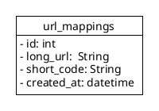

# shortener

## Use Case Diagram

## Database Diagram
 

## Algorithm Used to Generate the Short Code
The algorithm converts the latest id from the url_mappings table into a Base62 encoded string using a custom conversion function.

## Technologies Used 
- Python
- FastAPI
- Redis
- PostgreSQL
- Docker

## Requirements
- docker-compose

## How to run the project
<code>
docker compose -f src/docker-compose.yml up --build -d
</code>

## Web Interface for API Interaction
Access the interactive API documentation at:
[http://127.0.0.1:8000/](http://127.0.0.1:8000/)

## API Documentation
Access the full API documentation at:
- http://127.0.0.1:8000/docs

## How to stop the project 
<code>
docker compose -f src/docker-compose.yml down --remove-orphans
</code>

