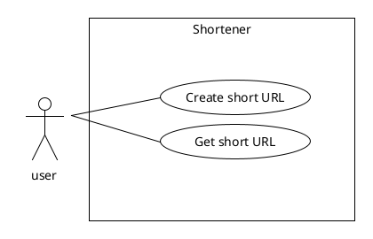

# shortener


## Use Case Diagram

## Database Diagram
 


## Algorithm Used to Generate the Short Code
### Current Alogrithm
The algorithm converts the latest id from the url_mappings table into a Base62 encoded string using a custom conversion function.

### Alternative Approach
An alternative idea is to generate a hash directly from the URL itself.

## Technologies Used 
- Python
- FastAPI
- Redis
- PostgreSQL
- Docker

## Requirements
- docker-compose

## How to run the project
```bash
docker compose -f src/docker-compose.yml up --build -d
```

## How to stop the project 
```bash
docker compose -f src/docker-compose.yml down --remove-orphans
```

## App Web Interface
Visit the app at:
[http://127.0.0.1:8000/](http://127.0.0.1:8000/)


## API Documentation
Access the full API documentation at:
[http://127.0.0.1:8000/docs/](http://127.0.0.1:8000/docs/)


